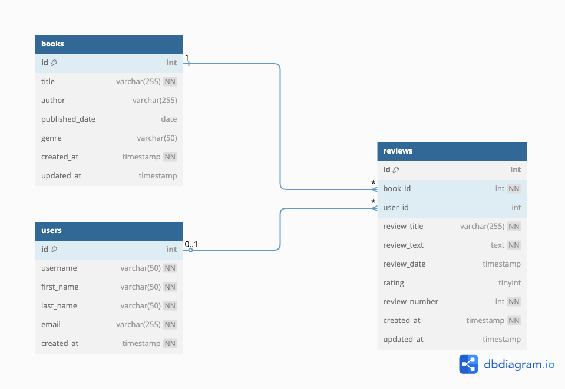

# BookClubReviews

A lightweight book review web application built to demonstrate Web Development with Python and MySQL.

## 🚀 Overview

BookClubReviews is a data-driven web app that allows users to:

* Submit reviews for books
* Browse existing reviews in both table and card formats
* Filter, sort, and limit results

The project was built using HTML, Python (CGI), and MySQL — without any frameworks or JavaScript — to help demonstrate the art of the possible and some of the trade-offs of being constrained.

---

## 🧱 Tech Stack

**Frontend:**

* HTML forms rendered server-side via Python CGI
* Responsive and mobile-friendly styling using a shared `style.css` file

**Backend:**

* Python 3 (CGI scripts)
* `pymysql` for MySQL access
* `cgitb` for inline error debugging

**Database:**

* MySQL with three normalized tables: `users`, `books`, `reviews`
* `review_number` tracks if a review is the 1st, 2nd, etc., by a user for a book

**Hosting:**

* Deployed on a CGI server via `public_html`
* File structure respects project constraints with all scripts in `/Project` folder

---

## 🗃️ Entity-Relationship Diagram (ERD)

```
users (id, username, first_name, last_name, email, created_at)
books (id, title, author, published_date, genre, created_at, updated_at)
reviews (id, book_id, user_id, review_title, review_text, review_date, rating, review_number, created_at, updated_at)
```

* A user can review multiple books
* Each review stores its historical order (`review_number`) relative to that user/book



---

## 🖥️ Pages

| Page                    | Description                                            |
| ----------------------- | ------------------------------------------------------ |
| `project.py`            | Landing page, links to all other views                 |
| `submit_review.py`      | Submit a new review using a validated form             |
| `view_reviews.py`       | Tabular format with filters and sort options           |
| `view_reviews_cards.py` | Card format showing styled reviews with ordinal labels |

All pages share a consistent navigation footer via an included `html/footer.html` partial.

---

## 🎯 Design Notes & Future Improvements

* **Shared Styling**: All pages use the same CSS file for consistency and mobile responsiveness.

* **View Layer Duplication**: The two review views (`view_reviews.py`, `view_reviews_cards.py`) share logic for filters and queries. This could be abstracted in future into a utility module.

* **Data Integrity**: The `review_number` is computed at insert time to preserve order. This enables enhancements like "2nd review" labels.

* **Constraints**: No JavaScript, frameworks, or persistent sessions were used.

---

## 📝 Author

Josh Mackie  
GitHub: [joshjbm](https://github.com/joshjbm)

---

## 📂 File Structure (Selected)

```
/Project
  ├── project.py
  ├── submit_review.py
  ├── view_reviews.py
  ├── view_reviews_cards.py
  ├── db_connect.py
  ├── db_config.py
  ├── assets/
  │   └── bcrERD.dbml
  │   └── bcrERD.png
  ├── data/
  │   └── data.sql
  │   └── tables.sql
  ├── html/
  │   └── footer.html
  │   └── style.css
```